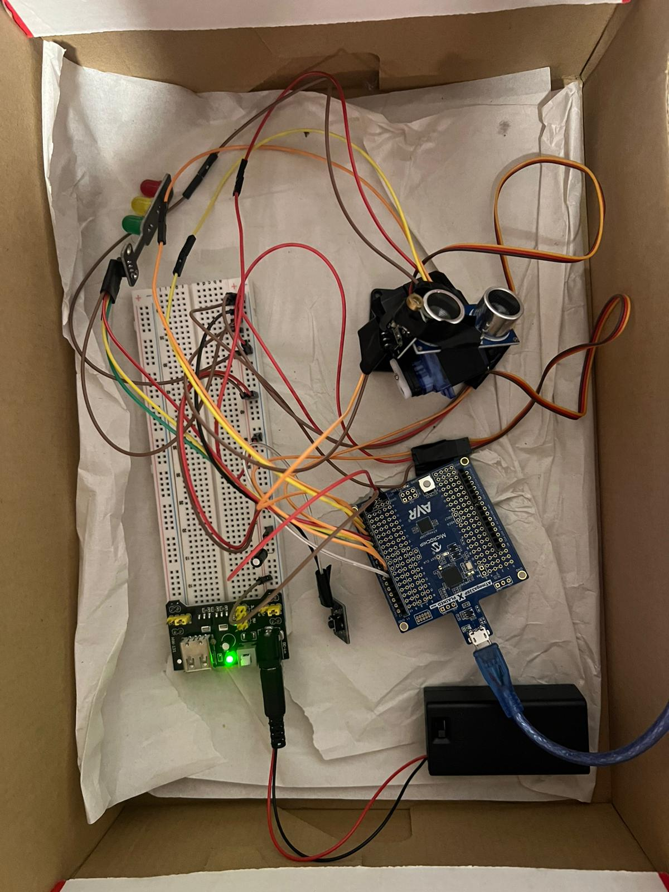
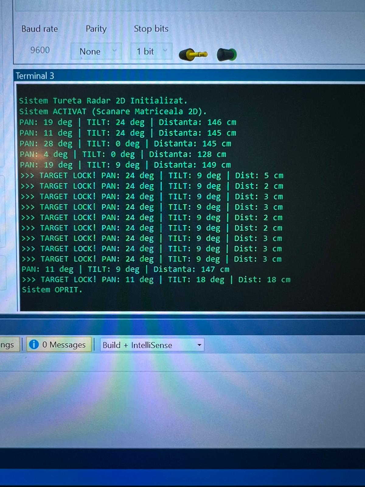

# Proiect-PM-Tureta-Radar

**Proiect Microprocesoare - Turetă Radar cu Target Lock**

## 1. Introducere
Acest proiect constă în dezvoltarea unui sistem automatizat de tip "Turetă Radar 2D", capabil să scaneze un perimetru fizic în două dimensiuni (Pan și Tilt) și să intercepteze ținte aflate în proximitate. 

**Scopul proiectului** este de a demonstra concepte avansate de inginerie a microprocesoarelor (ATmega328P), integrând controlul precis al servomotoarelor prin semnale PWM, măsurarea timpului de zbor folosind senzori ultrasonici (cu întreruperi hardware) și implementarea unui sistem de telemetrie UART pentru monitorizare în timp real.

**Funcționalitate principală:**
Tureta efectuează un baleiaj matriceal (Raster Scan). Când senzorul ultrasonic detectează un obstacol la o distanță critică (< 20 cm), sistemul intră în modul **TARGET LOCK**: îngheață mișcarea servomotoarelor exact pe coordonatele țintei, aprinde un modul laser pentru "fixare" și raportează blocajul în consola serială.

## 2. Design Hardware

Pentru a asigura stabilitatea sistemului, partea logică (microcontrolerul) este izolată energetic de partea de forță (servomotoarele) folosind un modul dedicat de alimentare.

### Piese folosite:
* **Microcontroler:** ATmega328P (Placă de dezvoltare Xplained Mini / compatibil Arduino Uno)
* **Senzor Ultrasonic:** HC-SR04 (pentru măsurarea distanței)
* **Acționare Mecanică:** 2 x Servomotoare SG90 (Axa Pan - orizontală, Axa Tilt - verticală)
* **Feedback Vizual:** * 3 x LED-uri (Verde, Galben, Roșu) - Semafor stări
  * 1 x Modul Laser 5V (pentru Target Lock)
* **Control Manual:** 1 x Buton push cu autoblocare (START/STOP)
* **Alimentare:** Modul Breadboard MB102 + Baterie 9V (pentru motoare și laser)

### Schema de conectare (Pinout ATmega328P):
* **Port D (Senzor & Feedback):**
    * `PD2` -> TRIG (Ieșire declanșare HC-SR04)
    * `PD3` -> ECHO (Intrare semnal HC-SR04, conectat la **INT1**)
    * `PD4` -> Modul Laser (Ieșire)
    * `PD5` -> LED Roșu (Stare: Critic / Target Lock)
    * `PD6` -> LED Galben (Stare: Avertizare, < 40 cm)
    * `PD7` -> LED Verde (Stare: Scanare Liberă, > 40 cm)
* **Port B (Motoare & Buton):**
    * `PB1` -> Semnal PWM Servo Pan (Timer 1 - OCR1A)
    * `PB2` -> Semnal PWM Servo Tilt (Timer 1 - OCR1B)
    * `PB3` -> Buton START/STOP (Intrare cu Pull-up intern activat)

## 3. Design Software

Proiectul a fost dezvoltat în **Microchip Studio** folosind limbajul **C** (Bare-metal programing, fără biblioteci externe de tip Arduino).

### Structura hardware internă utilizată:
1.  **Timer 1 (16-bit) - Control Servomotoare:**
    * Configurat în modul *Fast PWM* (Modul 14), cu pragul de top setat de `ICR1 = 39999` și prescaler 8, pentru a genera un semnal cu frecvența exactă de **50Hz** (perioadă 20ms), necesar servomotoarelor SG90.
    * Ciclu de lucru (Duty Cycle) controlat precis prin regiștrii `OCR1A` și `OCR1B`.
2.  **Întreruperea Externă (INT1) & Timer 2 - Citire Senzor Ultrasonic:**
    * Declanșarea (`TRIG`) trimite un puls de 10µs. Răspunsul (`ECHO`) activează întreruperea `INT1` la orice schimbare de front logic (Any logical change).
    * La front crescător, **Timer 2** (8-bit) pornește numărătoarea (cu prescaler 8). Funcția ISR contorizează depășirile (Overflow).
    * La front descrescător, Timer 2 se oprește. Timpul total este convertit în distanță (centimetri) printr-o formulă non-blocantă.
3.  **Transmisie Serială (UART):**
    * Configurată la **9600 baud rate** (8 biți date, fără paritate, 1 bit stop).
    * Transmite telemetria în timp real pe PC. Pentru a evita blocarea lățimii de bandă, sistemul folosește un contor și trimite pachete de date la fiecare 20 de pași mecanici în starea de scanare verde, dar raportează prioritar (la fiecare 500ms) când intră în "Target Lock".

### Mașina de stări (Logica Principală):
* **Sistem Oprit:** Motoarele revin în poziția 90°, LED-urile se sting, sistemul așteaptă apăsarea butonului.
* **Zona Verde (Distanță > 40cm):** Turela scanează rapid mediul. Consola afișează periodic telemetria.
* **Zona Galbenă (Distanță 20 - 40cm):** Mod precaut. Motoarele își reduc viteza de scanare, LED-ul galben este aprins.
* **Zona Roșie (Distanță < 20cm):** TARGET LOCK. Motoarele îngheață instantaneu pe coordonatele curente (Pan/Tilt). Laserul și LED-ul Roșu se aprind pe țintă. Consola primește raport de interceptare cu marcajul `>>>`. Sistemul reia scanarea doar după ce obiectul părăsește raza critică.

## 4. Rezultate și Demo Video

Sistemul a fost asamblat pe un breadboard și calibrat mecanic. Telemetria a fost verificată folosind Data Visualizer din Microchip Studio.

**Montajul fizic al proiectului:**

**Telemetria UART și Target Lock:**

**Link Demo Video:** [Introdu aici link-ul tău de YouTube cu sistemul mergând]

## 5. Concluzii
Proiectul a demonstrat cu succes integrarea mai multor periferice hardware pe un microcontroler ATmega328P. Am reușit optimizarea cinematicii robotului și filtrarea software a datelor UART pentru a oferi o scanare extrem de lină și rapoarte curate. Cea mai mare provocare a fost gestionarea independentă a alimentării externe pentru a preveni căderile de tensiune (Brown-out Reset) provocate de consumul simultan al celor două servomotoare.

## 6. Bibliografie
* Datasheet ATmega328P
* Laboratoarele de PM OCW (Timere, Întreruperi, UART, PWM)
* Datasheet HC-SR04 & SG90 Servo
